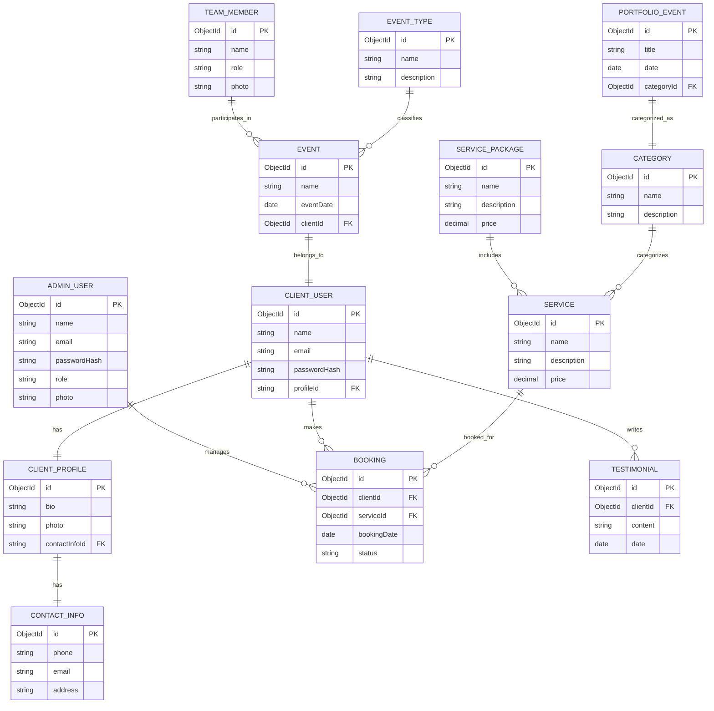

# Entity-Relationship (ER) Diagram

This ER diagram represents the main entities and their relationships in the system based on the server models.

```mermaid
erDiagram
    ADMIN_USER {
        ObjectId id PK
        string name
        string email
        string passwordHash
        string role
        string photo
    }
    CLIENT_USER {
        ObjectId id PK
        string name
        string email
        string passwordHash
        string profileId FK
    }
    CLIENT_PROFILE {
        ObjectId id PK
        string bio
        string photo
        string contactInfoId FK
    }
    CONTACT_INFO {
        ObjectId id PK
        string phone
        string email
        string address
    }
    BOOKING {
        ObjectId id PK
        ObjectId clientId FK
        ObjectId serviceId FK
        date bookingDate
        string status
    }
    SERVICE {
        ObjectId id PK
        string name
        string description
        decimal price
    }
    SERVICE_PACKAGE {
        ObjectId id PK
        string name
        string description
        decimal price
    }
    EVENT {
        ObjectId id PK
        string name
        date eventDate
        ObjectId clientId FK
    }
    TESTIMONIAL {
        ObjectId id PK
        ObjectId clientId FK
        string content
        date date
    }
    TEAM_MEMBER {
        ObjectId id PK
        string name
        string role
        string photo
    }
    CATEGORY {
        ObjectId id PK
        string name
        string description
    }
    EVENT_TYPE {
        ObjectId id PK
        string name
        string description
    }
    PORTFOLIO_EVENT {
        ObjectId id PK
        string title
        date date
        ObjectId categoryId FK
    }

    ADMIN_USER ||--o{ BOOKING : manages
    CLIENT_USER ||--o{ BOOKING : makes
    SERVICE ||--o{ BOOKING : booked_for
    SERVICE_PACKAGE ||--o{ SERVICE : includes
    CLIENT_USER ||--o{ TESTIMONIAL : writes
    CLIENT_PROFILE ||--|| CONTACT_INFO : has
    CLIENT_USER ||--|| CLIENT_PROFILE : has
    EVENT ||--|| CLIENT_USER : belongs_to
    PORTFOLIO_EVENT ||--|| CATEGORY : categorized_as
    TEAM_MEMBER ||--o{ EVENT : participates_in
    CATEGORY ||--o{ SERVICE : categorizes
    EVENT_TYPE ||--o{ EVENT : classifies
```

## Description

