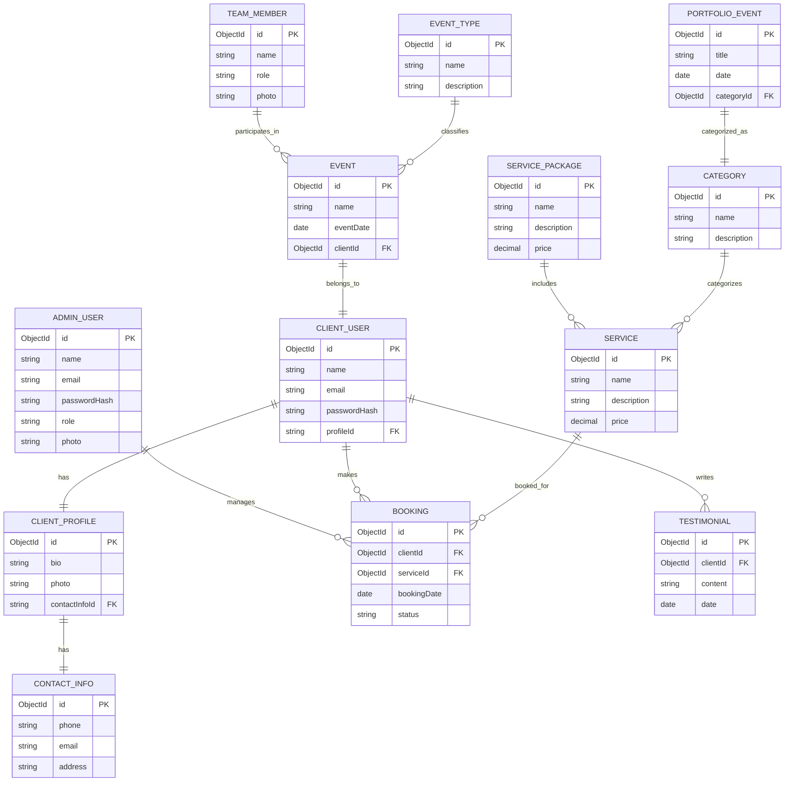

# Entity-Relationship (ER) Diagram

This ER diagram represents the main entities and their relationships in the system based on the server models.

## Description

- The diagram shows main entities like AdminUser, ClientUser, ClientProfile, Booking, Service, Event, Testimonial, TeamMember, Category, EventType, and PortfolioEvent.
- Relationships include bookings made by clients for services, services grouped in packages, client profiles linked to contact info, events linked to clients and event types, and portfolio events categorized.
- This ER diagram provides a high-level overview of the data model used in the backend.
