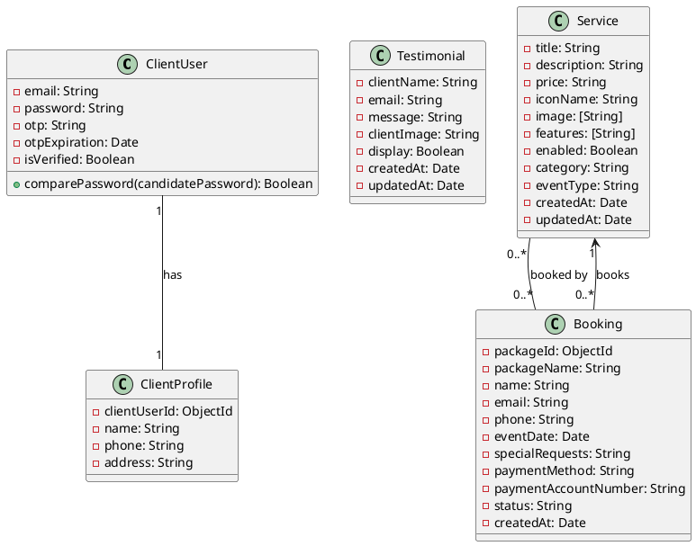

# Comprehensive UML and Architecture Diagram for Website

## Backend Data Models

## Admin Frontend

- Components:
  - CustomizeServiceDialog
  - EventGalleryDialog
  - HamburgerMenu
  - HorizontalCardScroller
  - Loading
  - ManagementMenu
  - PortfolioCategoryDialog
  - PortfolioEventDialog
  - RecentActivityDialog
  - ServiceDialog
  - TestimonialDialog
- Pages:
  - adminUsers.js
  - blog.js
  - categories.js
  - contact.js
  - customizeServices.js
  - dashboard.js
  - event-gallery.js
  - eventTypes.js
  - home.js (and variants)
  - index.js
  - messages.js
  - portfolio.js
  - profile-register.js
  - register.js
  - services.js
  - settings.js
  - signup.js
  - team.js
  - testimonials.js
  - verify-otp.js

## Client Frontend

- Components:
  - ClientPersonalDetailsForm
  - ContactForm
  - CustomizeServiceDialog
  - EditProfileDialog
  - EventGallery
  - Footer
  - HeroSection
  - LogoutLoadingOverlay
  - Navbar
  - ProfileEditDialogNew
  - ProfileForm
  - ProfilePictureUpload
  - ResetPasswordDialog
  - ServicePackages
  - Testimonials
- Pages:
  - about.js
  - client-profile.js
  - contact.js
  - dashboard.js
  - index.js
  - login.js
  - modern-personal-profile-registration.js
  - portfolio.js
  - profile.js
  - register.js
  - services.js
  - signup.js
  - testimonials.js
  - verify-otp.js

## Architecture Overview

- Backend exposes REST API endpoints consumed by both admin and client frontends.
- Admin frontend manages content, services, testimonials, users, and other administrative tasks.
- Client frontend provides user-facing pages and components for browsing services, testimonials, profiles, and bookings.
- Data models in backend represent core entities with relationships as shown in the UML diagram.
- Frontend components interact with backend APIs to fetch and update data.

This document provides a high-level overview of the website's backend data models, admin and client frontend components and pages, and their architectural relationships.
