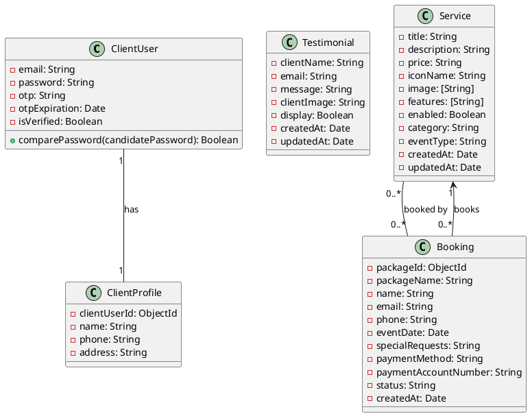

# UML Class Diagram for Website Backend

```plantuml
@startuml

class ClientUser {
  - email: String
  - password: String
  - otp: String
  - otpExpiration: Date
  - isVerified: Boolean
  + comparePassword(candidatePassword): Boolean
}

class ClientProfile {
  - clientUserId: ObjectId
  - name: String
  - phone: String
  - address: String
}

class Testimonial {
  - clientName: String
  - email: String
  - message: String
  - clientImage: String
  - display: Boolean
  - createdAt: Date
  - updatedAt: Date
}

class Service {
  - title: String
  - description: String
  - price: String
  - iconName: String
  - image: [String]
  - features: [String]
  - enabled: Boolean
  - category: String
  - eventType: String
  - createdAt: Date
  - updatedAt: Date
}

class Booking {
  - packageId: ObjectId
  - packageName: String
  - name: String
  - email: String
  - phone: String
  - eventDate: Date
  - specialRequests: String
  - paymentMethod: String
  - paymentAccountNumber: String
  - status: String
  - createdAt: Date
}

ClientUser "1" -- "1" ClientProfile : has
Booking "0..*" --> "1" Service : books
Service "0..*" -- "0..*" Booking : booked by

@enduml
```

This UML diagram shows the main entities and their relationships in the website backend.
